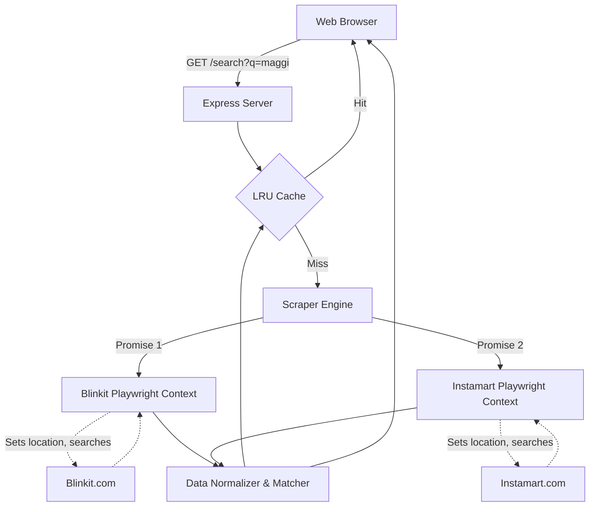

# Architecture Analysis: DTU Grocery Price Compare

## 1. Agent Profiles

To ensure a robust, realistic, and scalable design, this analysis was conducted via an internal debate among three distinct architectural personas:

*   **Pragmatic Shipper (PS):** Focuses on rapid delivery, user experience (the hungry 11 PM student), and keeping things simple. Wants to ship MVP with minimal overhead.
*   **Reliability Engineer (RE):** Obsesses over edge cases, failure modes, rate limits, and brittle code. Ensures the system degrades gracefully and doesn't crash when external dependencies fail.
*   **Scale Architect (SA):** Looks past the immediate requirements to understand what happens at 100x or 1000x load. Thinks about resource pooling, bottlenecks, and decoupling.

---

## 2. Debate Transcript

### Topic 1: Tech Stack
*   **PS:** "We should use Node.js with Express and Playwright. Node is non-blocking, which is perfect for firing off two scraper requests simultaneously. Plus, Playwright's JS API is top-tier."
*   **RE:** "Node is fine, but Python has better data manipulation (Pandas, fuzzywuzzy) for matching the products later. However, given the assignment requires DOM interaction without reverse engineering, Playwright on Node is arguably the most native ecosystem. We must ensure unhandled promise rejections don't crash the server."
*   **SA:** "Node is the right choice for I/O bound concurrent scraping. But we need to separate the web server from the scraping logic, even in a monolith, so we can easily break the scrapers out into background workers later."
*   **Verdict:** **Node.js + Express + Playwright.**

### Topic 2: Data Extraction
*   **PS:** "Just load the search URLs for Blinkit and Instamart, wait for the network to idle, and grab the first 3 items. Simple."
*   **RE:** "Waiting for network idle is a trap—ads or trackers will keep it spinning and cause timeouts. We must wait for *specific DOM elements* (e.g., the product card class). Also, since we aren't reverse engineering APIs, we're relying on DOM structures which change. We need fallback selectors and a hard timeout (e.g., 8 seconds). If a site detects us as a bot and throws a CAPTCHA, we need to fail gracefully, not hang."
*   **SA:** "Running a full browser instance per request won't scale past 5 concurrent users. For this assignment, we must use `playwright.chromium.launchPersistentContext` or browser contexts to reuse a single browser instance, rather than launching a new browser every time."
*   **Verdict:** **Playwright with a shared Browser Context, strict 8-second timeouts, and specific DOM element waits.**

### Topic 3: Product Matching
*   **PS:** "Lowercase the titles, split into words, and if they share 70% of the words, call it a match. 'Maggi Masala 70g' matches 'Maggi 2-Minute Noodles 70g'."
*   **RE:** "That's dangerous. 'Amul Butter 100g' and 'Amul Butter 500g' will match under that logic, and the user will see a completely skewed price comparison. We *must* extract the quantity/weight and treat it as a hard constraint."
*   **SA:** "At scale, we would use a vector database or LLM embeddings to map vendor SKUs to a master product catalog. For this OA, we should write a parser that isolates the 'brand/name' and the 'weight/volume'. If weights don't match exactly, they are not comparable."
*   **Verdict:** **Rule-based matching prioritizing Weight/Volume as a strict constraint, followed by string-distance matching on the normalized title.**

### Topic 4: Caching Strategy
*   **PS:** "No cache. Prices and stock change fast. The student needs to know if Maggi is actually available *right now*."
*   **RE:** "If we don't cache, two students searching 'Maggi' within a minute will trigger redundant scrapes, doubling our risk of getting IP banned by Blinkit. We need an in-memory LRU cache."
*   **SA:** "Agreed. A short TTL (Time-To-Live) cache of 5 minutes keyed by `[location_id]_[search_term]` provides a massive throughput boost while keeping data relatively fresh."
*   **Verdict:** **In-memory LRU cache with a 5-minute TTL.**

### Topic 5: Error Handling
*   **RE:** "What if Blinkit's site goes down, or they change their DOM and our scraper breaks?"
*   **PS:** "We just show an error to the user."
*   **RE:** "No, we show *Instamart's* results. Partial degradation. If Blinkit fails, the user still gets value. We return `{ blinkit: { error: true }, instamart: { data: [...] } }`."
*   **Verdict:** **Strict isolation of scraping promises (`Promise.allSettled`). Partial success is a valid state.**

---

## 3. Architecture Recommendation

Based on the debate, here is the recommended architecture for the OA:

### Component Breakdown
1.  **Express API:** Lightweight routing, input validation (sanitizing the query), and handling the HTTP response.
2.  **LRU Cache:** In-memory store mapping `searchTerm -> Results` for 5 minutes.
3.  **Scraper Engine:** Uses Playwright. It spins up a single browser on startup, and creates lightweight **Browser Contexts** for each request to avoid the overhead of launching Chromium repeatedly.
4.  **Data Normalizer & Matcher:** 
    *   Extracts price as a pure integer/float.
    *   Extracts weight/quantity (e.g., "70 g", "1 L").
    *   Attempts to align Blinkit Item A with Instamart Item B based on weight and string similarity.

### Key Trade-offs
*   **Playwright vs. Reverse-Engineered APIs:** We chose Playwright as mandated by the "no reverse engineering required" constraint. *Trade-off:* High CPU/Memory usage and slower response times (2-4 seconds) compared to direct API calls (200ms).
*   **In-Memory Cache vs. Redis:** Chose In-Memory (e.g., `lru-cache` npm package) to keep the setup zero-dependency for the evaluator. *Trade-off:* State is lost on server restart, and cannot be shared across multiple server instances.

---

## 4. Risk Register

| Risk Description | Likelihood | Impact | Mitigation Strategy |
| :--- | :---: | :---: | :--- |
| **DOM Structure Change:** Platforms change their CSS classes, breaking the scraper. | High | High | Use robust selectors (text matching, ARIA labels, layout-based selectors) rather than fragile CSS classes. Implement strict timeouts. |
| **Bot Detection / IP Block:** Platforms detect Playwright and serve a CAPTCHA or block the IP. | Medium | High | Use `playwright-stealth`. Randomize user agents. Implement the 5-minute cache to reduce redundant hits. |
| **High Latency:** Loading full JS frameworks for both sites takes >10 seconds, frustrating the user. | High | Medium | Block unnecessary resources in Playwright (images, fonts, stylesheets, analytics scripts). |
| **Mismatching Products:** App compares the price of a 100g pack with a 500g pack. | Medium | High | Strict parsing of the quantity string. If quantities don't match, do not present them as a direct 1:1 comparison. |
| **Server OOM (Out of Memory):** Playwright contexts leak memory or concurrent requests crash the Node process. | Low | High | Limit concurrent scraping tasks using a queue or semaphore. Close browser contexts aggressively in a `finally` block. |

---

## 5. Scalability Analysis

The current architecture is optimized for a local OA review. If we were to scale this:

*   **What changes for 10 locations?**
    *   *Currently:* The location is hardcoded to DTU.
    *   *Change:* The cache key must change from `[query]` to `[location_id]_[query]`. The Playwright setup phase must dynamically inject the user's coordinates or select the location from the UI before searching.
*   **What changes for 1000 users?**
    *   *First thing that breaks:* The Node.js server will run out of memory trying to run hundreds of concurrent Playwright contexts.
    *   *Change:* We must abandon Playwright. At 1000 users, we have to reverse-engineer the mobile or web APIs to fetch JSON directly, bypassing the browser entirely. Alternatively, we move Playwright to a scalable worker cluster (e.g., AWS Fargate/Lambda) and use a message queue, but this is cost-prohibitive.
*   **What changes for 10 platforms (Zepto, BigBasket, Swiggy, etc.)?**
    *   *Change:* The `Promise.allSettled` approach becomes a bottleneck if one platform is consistently slow. We would switch to a Server-Sent Events (SSE) or WebSocket architecture, streaming results to the frontend as they arrive (e.g., Blinkit pops up in 1s, Zepto in 2s), rather than making the user wait for the slowest platform.

---

## 6. Dissenting Opinions (Unresolved Debates)

*   **To Match or Not To Match:** The Pragmatic Shipper argued that attempting to programmatically match items (e.g., concluding Blinkit's "Maggi" is the *exact same* as Instamart's "Maggi") is a fool's errand without a massive product database, and we should instead just present two side-by-side lists and let the human brain do the matching. The Reliability Engineer insisted we must at least try to align them by weight to fulfill the prompt's spirit. We compromised on a basic weight-matching algorithm, but the fundamental disagreement remains.

---

## 7. Recommendations for the Design Note

When writing the final 1-page design note for the submission, emphasize the following:
1.  **Acknowledge the DOM fragility:** Openly admit that relying on DOM selectors is brittle, and explain *exactly* what measures you took to mitigate it (blocking images/fonts for speed, using fallback selectors).
2.  **Highlight the partial failure handling:** Evaluators love engineers who plan for failure. Point out that if Blinkit goes down, your app still serves Instamart data.
3.  **Explain the matching limitation:** Be brutally honest about where your product matching logic breaks down (e.g., "It works for 'Maggi 70g', but fails if Blinkit calls it '70g' and Instamart calls it '0.07kg'"). This shows maturity.
